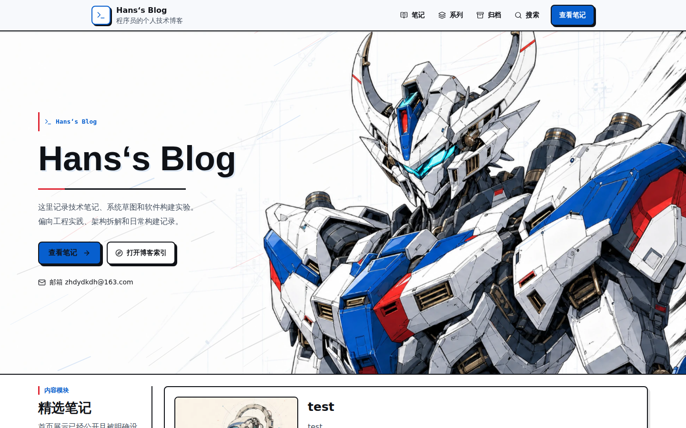

# Turnin's Blog

一个基于 Next.js、PostgreSQL 和 Prisma 构建的个人技术博客，包含响应式公开站点与单管理员写作后台。



## 主要功能

- 公开端：精选笔记、内容统计、笔记列表、搜索、标签、分类、归档和系列导航。
- 阅读体验：Markdown 渲染、代码高亮、文章目录、系列上下篇和相关文章。
- 管理后台：单管理员登录、草稿管理、发布/取消发布、精选设置与分类体系维护。
- 内容创作：基于 Tiptap 的可视化编辑器、Markdown 文件导入、图片上传与外部 HTTPS 图片。
- 安全与运维：Argon2 密码、数据库会话、CSRF 防护、登录限制、内容清洗、安全响应头及健康检查。

## 技术栈

- Next.js 16、React 19、TypeScript 6
- Tailwind CSS 4、Motion、Lucide React
- PostgreSQL、Prisma 7
- Tiptap 3、React Markdown、remark/rehype、Shiki
- Zod、Sharp、Argon2
- Vitest、Playwright、ESLint

## 环境要求

- Node.js 22
- npm
- PostgreSQL

## 本地运行

安装依赖：

```bash
npm ci
```

复制环境变量模板：

```bash
cp .env.example .env.local
```

在 `.env.local` 中配置：

| 变量 | 用途 |
| --- | --- |
| `DATABASE_URL` | PostgreSQL 连接地址 |
| `ADMIN_EMAIL` | 唯一管理员邮箱 |
| `ADMIN_PASSWORD_HASH` | 管理员密码的 Argon2 hash |
| `ADMIN_SESSION_SECRET` | 至少 32 个字符的会话签名密钥 |
| `ADMIN_SITE_ORIGIN` | 生产环境的最终 HTTPS origin，本地开发可留空 |
| `PLAYWRIGHT_ADMIN_PASSWORD` | 仅供本地或 CI 浏览器测试使用的管理员明文密码 |

从标准输入安全生成管理员密码 hash：

```bash
read -r -s ADMIN_PLAINTEXT
printf '\n'
printf '%s' "$ADMIN_PLAINTEXT" | npm run --silent admin:hash-password
unset ADMIN_PLAINTEXT
```

写入本地 `.env.local` 时，需要把 hash 中的每个 `$` 写成 `\$`；生产环境的 secret manager 应保存未转义的原始 hash。

初始化数据库与管理员：

```bash
npm run db:migrate:deploy
npm run db:generate
npm run admin:bootstrap
```

启动开发服务器：

```bash
npm run dev
```

默认访问地址为 `http://127.0.0.1:3000`，管理后台入口为 `http://127.0.0.1:3000/admin/login`。

新数据库不会自动写入示例文章，可以登录管理后台创建并发布第一篇笔记。

## 验证与构建

运行完整基础验证，包括 lint、单元测试、Prisma 校验与生成、生产构建和源码安全扫描：

```bash
npm run verify
```

运行浏览器测试：

```bash
npm run test:e2e
```

生产构建与启动：

```bash
npm run build
npm run start
```

## 项目结构

```text
src/app/          Next.js 路由、页面与 API
src/components/   公开站点、管理后台与编辑器组件
src/lib/          数据访问、认证、Markdown、媒体和安全逻辑
prisma/           数据模型与数据库迁移
src/tests/e2e/    Playwright 浏览器测试
public/images/    静态图片资源
deploy/           Nginx 与 systemd 部署配置
docs/             安全、发布验收与备份恢复文档
```

## 部署与安全

仓库提供了 Nginx、systemd、健康检查和数据库迁移配置，但正式公网部署仍需正确配置 TLS、反向代理、生产密钥、私有数据库、监控和备份恢复。

- [公网暴露安全审计](./docs/security/public-exposure-audit-2026-07-11.md)
- [PostgreSQL 备份与恢复](./docs/operations/postgres-backup-restore.md)
- [发布验收记录](./docs/release-acceptance-2026-07-11.md)
